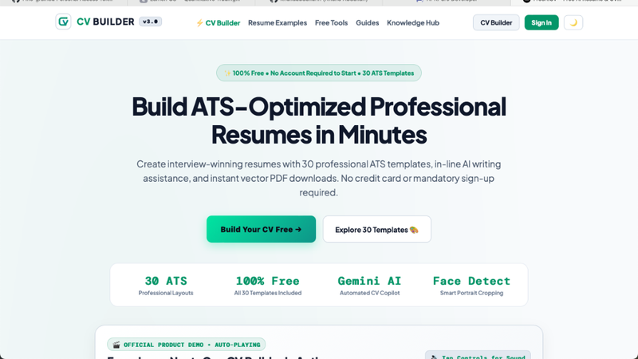

# 📄 CV-Builder – Land Your Dream Job Faster with AI (10 Models)


<p align="center">
  
</p>

**CV-Builder** is an intelligent, user-first resume creator designed to help job seekers, developers, and students craft outstanding, job-ready resumes in minutes. With built-in AI writing assistance, 10 tailored design models, custom profile photo support, and crisp 1-click PDF download, standing out to recruiters has never been easier!

---

## 🌟 How Users Benefit from CV-Builder

- **⚡ Save Hours of Formatting:** No more struggling with Word templates or misaligned layouts. Pick a model and get a beautifully structured CV instantly.
- **🤖 Stand Out to Recruiters with Smart AI:** Automatically polish your professional summary, refine work experience bullet points, and highlight key achievements.
- **🎯 Pass ATS Applicant Tracking Systems:** Models 1 & 6 are specifically designed to bypass ATS scanners used by top global companies.
- **📸 Flexible Customization:** Upload custom profile pictures with instant auto-compression, toggle between 10 distinct models, and tailor your CV for any job application.
- **🖨 1-Click HD PDF Download:** Download clean, print-ready PDF resumes without any watermark or site clutter.

---

## 🔗 Live Application Links

- 🚀 **Live Demo Site:** [https://first-project-plum-phi.vercel.app](https://first-project-plum-phi.vercel.app)
- 🌐 **Local Development Server:** [http://localhost:3000](http://localhost:3000)

---

## 🎨 10 Versatile CV Templates for Every Profession

1. **Model 1: Classic Academic / ATS** — Minimal single-column formal text layout for traditional job applications.
2. **Model 2: Modern Dark Sidebar** — 2-column visual layout with photo frame, skill rating bars, and SCAN ME QR code.
3. **Model 3: Executive Minimalist** — Elegant teal accent styling with skill pill badges and timeline bullet dots.
4. **Model 4: Creative Developer (Dark Terminal Theme)** — Monospace code terminal vibe tailored for developers and AI engineers.
5. **Model 5: Clean Split Banner** — Full-width photo header banner and clean 2-column split for skills vs experience.
6. **Model 6: Swiss Grid (ATS Master)** — High-contrast black & white international grid for maximum ATS reader compatibility.
7. **Model 7: Modern Infographic** — Visual gradient header, highlight metric cards, and skill dot ratings (`••••○`).
8. **Model 8: Minimalist Monochrome** — Sleek slate sidebar with photo frame, clean typography, and modern split.
9. **Model 9: Gradient Timeline** — Vibrant cyan gradient banner header with timeline node connection dots.
10. **Model 10: Executive Gold & Navy** — Premium C-suite corporate design with gold accents & elegant serif typography.

---

## 🚀 Quick Setup Guide

### 1. Install & Run Locally
```bash
git clone https://github.com/khalidabdullahh/CV-Builder.git
cd CV-Builder
npm install
npm run dev
```

### 2. Configure Gemini AI Key (.env.local)
```env
GEMINI_API_KEY=your_gemini_api_key_here
```
*(Get a free API key from [aistudio.google.com/app/apikey](https://aistudio.google.com/app/apikey))*

---

## 👤 Created By
**Khalid Abdullah** — Computer Science Undergraduate & Aspiring AI/ML Engineer.
- **GitHub:** [github.com/khalidabdullahh](https://github.com/khalidabdullahh)
- **LinkedIn:** [linkedin.com/in/khalidabdullahh](https://www.linkedin.com/in/khalidabdullahh/)
