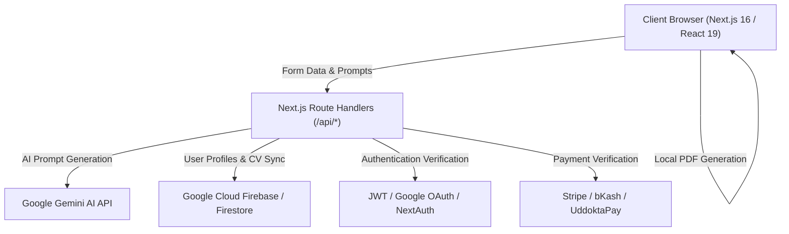

# 🚀 FreeAICV.me — The World's Most Powerful AI Career & ATS Resume Platform (30 Models + 17 Tools)

[](https://www.freeaicv.me)
[-black?style=for-the-badge&logo=next.js)](https://nextjs.org/)
[](https://react.dev/)
[](https://ai.google.dev/)
[](https://www.freeaicv.me/tools/resume-checker)
[](LICENSE)

<p align="center">
  
</p>

---

## 🌟 Overview

**[FreeAICV.me](https://www.freeaicv.me)** is an enterprise-grade, open-access AI career enablement platform designed to help job seekers, software engineers, recent graduates, and executives land top-tier global opportunities. 

Unlike traditional resume builders that lock users behind predatory paywalls or export broken multi-column graphics that fail Applicant Tracking Systems (ATS), FreeAICV provides **30 recruiter-vetted ATS templates**, an automated **17-tool AI career suite**, a **75-post SEO knowledge base**, and **instant, unwatermarked vector PDF downloads**.

---

## ⚡ Key Highlights & Core Capabilities

### 1. 🎯 30 Calibrated ATS Resume Templates
- **100% Vector PDF Output:** Clean semantic text layers easily parsed by Workday, Greenhouse, Taleo, Lever, and iCIMS.
- **Role-Calibrated Layouts:** Specifically designed for Software Engineers, Product Managers, Data Scientists, UI/UX Designers, Freshers, Healthcare Professionals, and Executives.
- **Smart 1-Page Geometry:** Automated margin, typography, and line-height calibration guaranteeing clean 1-page fit without overflowing or clipping.
- **Custom Visual Modes:** Interactive theme toggle (Dark/Light mode), accent color palettes, optional profile picture upload with auto-compression, and QR code integration.

### 2. 🤖 Complete 17-Tool AI Career Documents Suite
Integrated AI Copilot powered by **Google Gemini AI** to automate every step of the job application pipeline:
1. **Resume & ATS Checker (`/tools/resume-checker`):** Instant scoring against 18 ATS criteria with actionable fixes.
2. **Resume Keyword Matcher (`/tools/resume-keyword-matcher`):** Compares resume text with job descriptions to compute match percentage and identify missing keywords.
3. **Resume Score (`/tools/resume-score`):** In-depth metric-driven rubric evaluation across impact, formatting, and brevity.
4. **AI Resume Bullet Generator (`/tools/resume-bullet-generator`):** Converts plain tasks into high-impact Google X-Y-Z achievements.
5. **AI Resume Summary Generator (`/tools/resume-summary-generator`):** Crafts customized elevator pitches by seniority level.
6. **AI Resume Skills Generator (`/tools/resume-skills-generator`):** Extracts categorized hard and soft technical skills by industry.
7. **Cover Letter Generator (`/tools/cover-letter-generator`):** Generates bespoke, tailored cover letters matching job specs.
8. **Cover Letter Builder (`/tools/cover-letter-builder`):** Live interactive cover letter editor with one-click PDF export.
9. **Executive Bio Builder (`/tools/executive-bio-builder`):** Professional 1-page bios for founders, board members, and directors.
10. **Rate Card Builder (`/tools/rate-card-builder`):** Sleek pricing and service rate sheets for freelancers, contractors, and agencies.
11. **Statement of Purpose (SOP) Builder (`/tools/statement-of-purpose`):** Academic and graduate school admissions essays.
12. **Project One-Pager Builder (`/tools/project-one-pager`):** High-impact project briefs for engineering demos and case studies.
13. **Resignation Letter Builder (`/tools/resignation-letter-builder`):** Graceful, professional 2-week notice letters.
14. **Interview Follow-Up Email Generator (`/tools/interview-follow-up`):** High-converting post-interview thank-you notes.
15. **Reference Sheet Builder (`/tools/reference-sheet-builder`):** Professional reference sheets matching resume styling.
16. **Cold Email Campaign Manager (`/admin/cold-email`):** Recruiter outreach automation with template variables.
17. **CV Comparison & Analyzer (`/api/cv/job-match`):** Real-time NLP token matching backend.

### 3. 📚 75-Post Recruiter Knowledge Base & 30 Role Guides
- **75 Masterclass Blog Posts (`/blog`):** Over 186,000 words covering ATS parsing algorithms, salary negotiations, technical interviews, and resume writing.
- **30 Role-Specific Landing Pages (`/resume-examples/[role]`):** Full sample resumes, salary data, ATS keyword matrices, and downloadable templates.
- **Audience Masterclasses:** Dedicated 1,500+ word landing guides for Students (`/resume-for-students`), Fresh Graduates (`/resume-for-freshers`), Career Switchers (`/resume-for-career-changers`), Candidates with No Experience (`/resume-builder-no-experience`), and 1-Page Resume Formats (`/one-page-resume-templates`).

### 4. 💳 Multi-Gateway Monetization & Admin Portal
- **Global Payments:** Stripe Checkout (Credit/Debit Card) & Web3 / Crypto payments.
- **Local Bangladesh Gateways:** bKash API integration & UddoktaPay automated checkout.
- **Admin Dashboard (`/admin`):** Live payment review, manual transaction approvals/rejections, and user analytics.

---

## 🏗 System Architecture & Tech Stack



| Layer | Technologies |
|---|---|
| **Framework** | [Next.js 16.2.7](https://nextjs.org/) (App Router, Turbopack, Server Actions) |
| **UI & Styling** | [React 19](https://react.dev/), [Tailwind CSS](https://tailwindcss.com/), Framer Motion, Plus Jakarta Sans |
| **AI Engine** | [Google Gemini 2.5 Flash / Pro API](https://ai.google.dev/) via `@google/genai` SDK |
| **Database & Auth** | [Firebase Firestore](https://firebase.google.com/), Google OAuth 2.0, JWT Tokens |
| **Payments** | Stripe API, bKash Checkout, UddoktaPay, Direct Crypto Trans |
| **SEO & Performance** | Next.js Metadata API, Dynamic JSON-LD Schema, XML Sitemap, OpenGraph Generator |
| **Hosting & CI/CD** | [Vercel](https://vercel.com/), GitHub Actions |

---

## 📂 Project Structure

```text
CV Builder/
├── app/
│   ├── layout.js                         # Global root layout, font loaders & metadata
│   ├── page.js                           # Homepage landing with interactive hero & showcases
│   ├── cv-builder/                       # Core 30-Template Interactive Resume Builder
│   ├── resume-examples/                  # 30 Role-specific career landing pages
│   │   ├── [role]/page.js                # Dynamic role pages (Software Engineer, PM, etc.)
│   ├── blog/                             # 75-Post Masterclass SEO knowledge base
│   │   ├── [slug]/page.js                # Dynamic blog post reader with rich schemas
│   ├── tools/                            # 17+ AI Career Tool Standalone Applications
│   │   ├── resume-checker/               # ATS Score & formatting auditor
│   │   ├── resume-keyword-matcher/       # Job description comparison engine
│   │   ├── resume-bullet-generator/      # Google X-Y-Z achievement writer
│   │   ├── cover-letter-builder/         # Interactive cover letter creator
│   │   ├── executive-bio-builder/        # Executive 1-page bio builder
│   │   └── ... (12 other tools)
│   ├── admin/                            # Payment approval & cold email campaign portal
│   ├── api/                              # Secure backend route handlers
│   │   ├── cv/                           # CV generation, optimization & ATS scoring
│   │   ├── tools/                        # AI summary, bullet & cover letter endpoints
│   │   ├── auth/                         # Login, registration & OAuth handlers
│   │   └── bkash/ uddoktapay/ stripe/    # Webhook & payment verification endpoints
│   └── components/                       # Shared UI components (Navbar, Footer, Toasts)
├── lib/
│   ├── blogData.js                       # 75 Full masterclass blog articles (93,000+ words)
│   ├── rolesData.js                      # 30 Complete professional roles dataset
│   ├── firebase.js                       # Firebase Firestore & Auth client
│   ├── seo.js                            # Dynamic metadata & OpenGraph generators
│   └── routes.js                         # Centralized route definitions
└── public/                               # Static icons, vector assets, and previews
```

---

## 🚀 Getting Started Locally

### 1. Prerequisites
- **Node.js:** v18.18.0 or higher (v20+ recommended)
- **npm:** v9.0.0 or higher

### 2. Clone the Repository
```bash
git clone https://github.com/khalidabdullahh/freeaicv.me.git
cd freeaicv.me
```

### 3. Install Dependencies
```bash
npm install
```

### 4. Configure Environment Variables
Create a `.env.local` file in the root directory:
```env
# Google Gemini AI Key
GEMINI_API_KEY=your_gemini_api_key_here

# Firebase Configuration
NEXT_PUBLIC_FIREBASE_API_KEY=your_firebase_key
NEXT_PUBLIC_FIREBASE_AUTH_DOMAIN=your_project.firebaseapp.com
NEXT_PUBLIC_FIREBASE_PROJECT_ID=your_project_id
NEXT_PUBLIC_FIREBASE_STORAGE_BUCKET=your_project.appspot.com
NEXT_PUBLIC_FIREBASE_MESSAGING_SENDER_ID=your_sender_id
NEXT_PUBLIC_FIREBASE_APP_ID=your_app_id

# JWT & Authentication Secret
JWT_SECRET=your_jwt_secret_key_here

# Payment Gateways (Optional for local dev)
STRIPE_SECRET_KEY=your_stripe_secret
BKASH_APP_KEY=your_bkash_key
UDDOKTAPAY_API_KEY=your_uddoktapay_key
```
*(Get a free Gemini API key from [aistudio.google.com](https://aistudio.google.com/app/apikey))*

### 5. Start Development Server
```bash
npm run dev
```
Open [http://localhost:3000](http://localhost:3000) in your browser.

### 6. Production Build & Test
```bash
npm run build
npm run start
```

---

## 🎨 30 ATS Resume Templates Catalog

| # | Template Name | Style / Target Audience |
|---|---|---|
| **01** | Modern Tech ATS | Clean single-column linear layout for Software Engineers |
| **02** | Minimalist Pro | Sleek typography with subtle dividers for General Tech |
| **03** | Data & Systems | Metric-focused layout for Data Scientists & ML Engineers |
| **04** | Executive Grid | High-contrast visual hierarchy for Product Managers |
| **05** | Fresher & Graduate | Project-first layout with coursework for Students & Freshers |
| **06** | UI/UX Product Design | Portfolio-linked modern structure for Designers |
| **07** | Performance Marketing | High-ROI campaign highlights for Growth & Digital Marketers |
| **08** | Cloud & DevOps | Infrastructure stack highlights for Cloud Engineers |
| **09** | Full-Stack Architect | Microservices & system design bullets for Senior Developers |
| **10** | AI & Prompt Specialist | LLM fine-tuning & NLP project showcases for AI Engineers |
| **11-30** | Specialized Industry Models | Cybersecurity, Finance, Healthcare, Sales, HR, Executive CEO, Career Pivot, and more |

---

## 👨‍💻 Author & Maintainer

**Khalid Abdullah**
- **Website:** [https://www.freeaicv.me](https://www.freeaicv.me)
- **GitHub:** [@khalidabdullahh](https://github.com/khalidabdullahh)
- **LinkedIn:** [linkedin.com/in/khalidabdullahh](https://www.linkedin.com/in/khalidabdullahh/)

---

## 📄 License & Copyright

Copyright © 2026 **Khalid Abdullah**. All rights reserved.
Built with ❤️ for job seekers worldwide.
